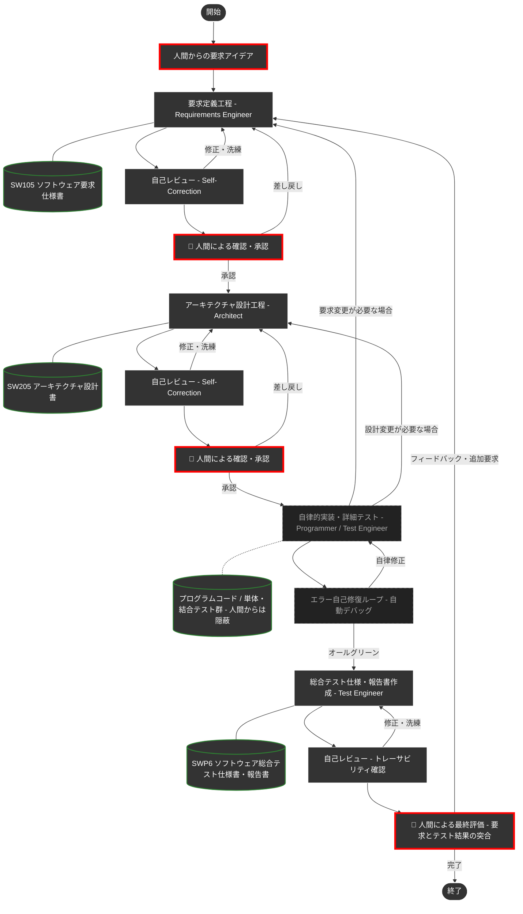

# スマートシーンのデモシステム開発プロジェクト


本プロジェクトは、以下の2つの目的を持つ実験プロジェクトです。

1. **DADA（Document-and-Agent-Driven Agile）開発プロセスの実験**: AIエージェントとのペアプログラミングにおける開発プロセス「DADA」自体を開発・評価するための実験場です。
2. **OSDVI APIの効果実証**: OSDVI（Open SDV Initiative）が標準化を進める車両APIを用いたデモシステムを構築し、APIの活用効果を示します。

デモシステムは、XPENGの「スマートシーン」に触発されて作成しました。XPENGは、ユーザが「車両条件が成立したとき、車両の一部機能を動かす」ことを許可しています。例えば、「雨が降ってきたら、ワイパーを動かすだけでは無く、デフロスタやデフォッガを動かして曇り止めをする」という動作などを、ユーザが作り込めるようになっています。

このように車両条件を調べたり、ワイパーなどを操作するためには、それらの情報にアクセスし制御するAPIが公開されている必要があります。本デモシステムは、OSDVIの公開資料（https://www.nces.i.nagoya-u.ac.jp/osdvi/index.html ）に基づいて、クルマを操作します。

> [!WARNING]
> **DADAプロセスのバージョンについて**: 本リポジトリに適用されているDADAプロセスは、最新版ではない可能性があります。DADAプロセスはこのプロジェクトとは独立に改訂を続けているためです。最新版は [AntigravityTemplate](https://github.com/yamaPiT/AntigravityTemplate) を参照してください。また、OSDVIのAPI仕様も変更される可能性があります。

> [!IMPORTANT]
> **人間はコードを一切書いていません**: このデモシステムの開発において、作者はプログラムコードを一切書いていません。すべてDADAプロセスに従い、AIエージェントに作成させました。
>
> **プログラム言語について**: 本デモシステムのプログラム言語は、PC上での実装しやすさを優先して選定しています。実車の開発言語とは一致しない可能性が高い点にご留意ください。

---
👉 **[すぐに自分のPCでデモを動かしてみたい方はこちら（インストール・起動手順）へジャンプ](#-実行環境とインストール要件-環境構築)**
---

## 📖 DADAプロセスとは？

**DADA（Document-and-Agent-Driven Agile）** は、**開発ドキュメントを中心**にAIエージェントが自律的に開発を進めるアジャイル開発手法です。

従来のアジャイル開発では、要求仕様がポストイットやホワイトボードに書かれて散逸したり、実装コードばかりが重視された結果、「要求仕様書・設計書とソースコードが乖離してしまう」という問題が少なからず発生していました。
DADAプロセスはこの発想を反転させ、**開発ドキュメントをシステムの唯一の情報源（Single Source of Truth）** として常に最新に保ちながら開発を進めます。要求・設計・テスト仕様とソースコードが乖離する余地を、プロセスの構造そのもので排除しています。

### なぜAgentic Codingでもドキュメント中心なのか？

「AIがコードを書いてくれるなら、ドキュメントはもう要らないのでは？」—— そう思われるかもしれません。しかし、AIにプログラミングを自律的に任せる手法（Agentic Coding）には、次の**2つの致命的な弱点**があります。

| # | 問題 | 何が起きるか |
|:---:|:---|:---|
| 1 | **記憶喪失** | AIの一時メモリ（コンテキストウィンドウ）は有限です。対話が長くなると、過去に合意した仕様や設計が押し出されて消え、中・大規模開発では整合性がすぐに破綻します。 |
| 2 | **ブラックボックス化** | この問題を防ぐためAI自身に内部メモを自動生成させるアプローチもありますが、それはAIの都合で書かれたものです。人間が読んでも理解しづらく、意図通りに品質を制御・レビューすることが困難です。 |

つまり、AI時代であっても「人間が読み、理解し、承認できる開発ドキュメント」の重要性はむしろ増しているのです。

### DADAの答え

> **「一時的な会話データや内部メモではなく、人間が読める『開発ドキュメント』を唯一の情報源にする」**

AIはコードを書く前に必ず「要求仕様書」や「設計書」を作成・更新し、**人間がそれを承認してから次の工程へ進みます**。ドキュメントは常にコードより先に更新されるため、「ドキュメントが古い」「仕様と実装が合っていない」という事態が構造的に発生しません。

### 🌟 DADAプロセスを支える5つの仕組み

| 仕組み | 説明 |
|:---|:---|
| **承認ゲート方式** | 各工程で人間がドキュメントを承認するまで次の工程に進めません。仕様と実装のズレを構造的にゼロにします。 |
| **実装・テストの自律カプセル化** | 細かなコーディングやデバッグはAIの自律ループ内に隠蔽されます。人間は「要求に合った総合テストの結果」だけを評価すれば済みます。 |
| **アテンション・リセット** | 開発タスクが切り替わる際、AIが自律的に不要な過去のチャット履歴を捨て、最新の承認済みドキュメントだけに集中し直します。記憶喪失の問題を根本から回避します。 |
| **品質とコストの自動調整** | 初回作成時はASDoQ品質モデルに基づく高品質文書を生成し、軽微な修正時はガイドラインの再読み込みをスキップして、トークンと時間を節約します。 |
| **一瞬の自己校正** | 各工程の作業後、AI自身が「専門レビュアー」にペルソナを切り替え、品質基準に照らして自己チェック・修復を行います。 |

DADAプロセスのAntigravity用テンプレートは [AntigravityTemplate](https://github.com/yamaPiT/AntigravityTemplate) で公開しています。

---

## 🗺️ DADAプロセス フロー図

人間が関与するのは**3つの意思決定ポイント**だけです（🔴 赤枠で表示）。詳細なコード実装とデバッグはAIエージェントが自律的に処理します。



---

## 📁 リポジトリ構成

| ディレクトリ | 役割 | 主な内容 |
| :--- | :--- | :--- |
| [`.agents/`](.agents/) | **エージェントの脳** | 工程別の専門スキル (`skills/`) と標準手順書 (`workflows/DADA-Process.md`) |
| [`docs/`](docs/) | **ナレッジ・ベース** | ドキュメントテンプレート、ASDoQ品質モデル、作業ガイドライン |
| [`doc/`](doc/) | **開発成果物** | 人間が確認・承認するドキュメント (SW105要求仕様書、SW205設計書、SWP6テスト報告書) |
| [`.cursor/`](.cursor/) | **全体制御** | 全ルールの定義場所 (`project-rules.mdc`) — 共通原則はここに集約 |

### スキル一覧

| スキル | 役割 | 種別 |
| :--- | :--- | :--- |
| `requirements-engineer` | 要求定義の壁打ちと仕様書作成 | 本体スキル |
| `architect` | アーキテクチャ設計 | 本体スキル |
| `programmer` | 設計に基づく実装 | 本体スキル |
| `test-engineer` | テスト設計・実行・報告書作成 | 本体スキル |
| `requirements-reviewer` | 要求仕様書の品質レビュー | 自己校正ペルソナ |
| `architecture-reviewer` | 設計書の品質レビュー | 自己校正ペルソナ |
| `code-reviewer` | ソースコードの品質レビュー | 自己校正ペルソナ |
| `test-reviewer` | テスト結果の品質レビュー | 自己校正ペルソナ |
| `asdoq-compliance` | ASDoQ文書品質モデル準拠チェック | project-rules.mdc に統合 |

---

## ✨ スマートシーンのデモシステムの主な機能

* **イグニッション状態遷移**: START/STOPによるシステム全体（アクチュエータやシナリオエンジン）の稼働統制。
* **物理挙動のシミュレーション**: 窓の開閉モーター制御（3秒間での目標値追従）や、長押しによるマニュアル/オート開閉の切り替え。
* **高度なオーバーライド（手動介入）ロジック**: 自動制御中にドライバーが手動操作を行った際、システムが優先権を譲る「ドライバー・イン・ザ・ループ」の原則の実装。
* **エッジ検出によるシナリオ復帰**: 手動介入後も、環境条件（雨量など）が再成立した瞬間に自動制御へシームレスに復帰する最新の制御ロジック。
* **APIビューア**: 要件定義（自然言語）とOSDVIが公開したAPI仕様書を併記し、Read-Onlyで表示。

## 🚀 搭載されているスマートシーン

1. **雨天時スマートシーン**: 雨量センサ（0〜100%）に連動し、窓の自動閉鎖、ワイパー動作、デフォッガの自動起動を行います。雨が止むと元の状態に復元（RESTORE）します。
2. **サンキューハザード**: 走行中にウインカーを操作すると、レーンチェンジ後に自動でハザードが3秒間点滅し、周囲に感謝を伝えるシーケンスが発動します。

### 💡 スマートシーンの開発経緯と仕様書の連携について

* 窓の開閉やウインカーの点灯・消灯などの車両操作には、OSDVIが [https://www.nces.i.nagoya-u.ac.jp/osdvi/index.html](https://www.nces.i.nagoya-u.ac.jp/osdvi/index.html) で公開している以下の情報を用いました。

* APIコンセプト、ボディー/キャビン、HMI
    * 仕様書：Open SDV [API仕様-202603α.pdf](https://www.nces.i.nagoya-u.ac.jp/osdvi/images/202603/Open%20SDV%20API%E4%BB%95%E6%A7%98-202603%CE%B1.pdf)
    * 補足資料：[APIコンセプト補足資料公開用-202603α.pdf](https://www.nces.i.nagoya-u.ac.jp/osdvi/images/202603/API%E3%82%B3%E3%83%B3%E3%82%BB%E3%83%97%E3%83%88%E8%A3%9C%E8%B6%B3%E8%B3%87%E6%96%99%E5%85%AC%E9%96%8B%E7%94%A8-202603%CE%B1.pdf)
    * 実装例：[ウィンドウ制御実装例-260327.pdf](https://www.nces.i.nagoya-u.ac.jp/osdvi/images/202603/%E3%82%A6%E3%82%A3%E3%83%B3%E3%83%89%E3%82%A6%E5%88%B6%E5%BE%A1%E5%AE%9F%E8%A3%85%E4%BE%8B-260327.pdf)
* AD/ADAS（車両運動状態・制御(Motion),ドライバ(Drivewr),自車位置(CurrentLocation),周辺環境モデル(SurroundModel)）
    * 補足資料：[Motion補足資料-202603α.pdf](https://www.nces.i.nagoya-u.ac.jp/osdvi/images/202603/Motion%E8%A3%9C%E8%B6%B3%E8%B3%87%E6%96%99-202603%CE%B1.pdf)
* AD/ADAS
    * 車両運動状態・制御
        * 仕様書・解説書：[OSDVI_API解説書_Motion-202509α.pdf](https://www.nces.i.nagoya-u.ac.jp/osdvi/images/202509/OSDVI_API%E8%A7%A3%E8%AA%AC%E6%9B%B8_Motion-202509%CE%B1.pdf)
    * ドライバ
        * 仕様書：[OSDVI_Driver_API(202509α).pdf](https://www.nces.i.nagoya-u.ac.jp/osdvi/images/202509/OSDVI_Driver_API(202509%CE%B1).pdf)
        * 解説書：[OSDVI_API解説書_Driver-202509α.pdf](https://www.nces.i.nagoya-u.ac.jp/osdvi/images/202509/OSDVI_API%E8%A7%A3%E8%AA%AC%E6%9B%B8_Driver-202509%CE%B1.pdf)

**要求定義・設計・実装のすべてをAIに任せており、APIの使用方法や実装方法について人間による検証は行っていません。**
* DADAプロセスでは本来、Antigravity内で要求仕様書を作成します。しかし、多くの外部資料をAIに読み込ませて壁打ちすると**トークン使用量がAntigravityの制限を超える**ため、本プロジェクトではAntigravityの外（Gemini Web）で要求仕様書と設計書を作成しました。
* 今後は、`./doc` フォルダ下に仕様書を配置してAIに参照させれば、Antigravity内のAIだけで新しいスマートシーンシナリオを作成できる可能性があります。
* なお、AIが仕様書から名前を引用しており、引用元の仕様書はルールエディタのルールにコメント記述されています。

---

## 📋 実行環境とインストール要件 (環境構築)

本システムを自分のパソコンで動かすには、以下のソフトを入れる必要があります。

* **Node.js (必須)**: Webアプリなどを動かすための土台です。
  [Node.js 公式サイト](https://nodejs.org/ja) を開き、**「LTS（推奨版: Recommended For Most Users）」** と書かれた緑色のボタンを押してダウンロードし、インストールしてください。（インストール中の設定はすべて次へでOKです）
* ※「3Dカーシミュレータ」を表示するための特殊なプログラムファイルなどは、後述の起動コマンドを実行した際に自動的に全て揃う仕組みになっています。個別に入れる必要はありません。

---

## 💻 起動方法１：通常のパソコンでお使いの方（おすすめ）

ここでは、GitHubやプログラミングの特別な知識がなくても動かせる手順を説明します。

**1. プログラムのダウンロードと解凍**
* 今見ているこの画面（GitHub）の右上にある **緑色の `<> Code`** というボタンをクリックし、一番下にある **`Download ZIP`** を選んでパソコンに保存します。
* 保存したZIPファイルを右クリックし、「**すべて展開**（または解凍）」を選んで、フォルダとして開きます。
  * ⚠️ **注意**: ZIPファイルを展開せずに中身を直接開こうとするとエラーになります。必ず「展開（解凍）」してください。

**2. 黒い画面（ターミナル・コマンドプロンプト）の準備**
* 解凍してできたフォルダ（`SmartScene-main` など）を開き、ファイルがたくさん並んでいる画面に行きます。
* **Windowsの方**: フォルダの上の枠（ファイルの場所・パスが表示されているアドレスバー）をクリックして文字を全部消し、そこに半角で `cmd` と入力してEnterキーを押すと、黒い画面が開きます。
* **Macの方**: フォルダを右クリックし、「フォルダにかかわる新規ターミナル」等を選んで画面を開きます。（または Spotlight検索で「ターミナル」を開き、`cd ` と打った後にフォルダをドラッグ＆ドロップしてEnterを押します）

**3. 起動コマンドの入力と実行**
* 開いた黒い画面に、以下のコマンドを **1行ずつ** コピーして貼り付け、Enterキーを押します。

```bash
npm install
```
> 💡 **少し時間がかかります**: パソコンの性能やネット回線によっては、文字がダァーっと流れて数分かかる場合がありますが、止まっていなければ正常です。焦らずお待ちください！（警告・WARNが出ても基本は無視して大丈夫です）

完了したら、次のコマンドを入力してEnterキーを押します。

```bash
npm run dev
```

**4. ブラウザで確認**
* 上記のコマンドを入れると `ready started server on ...` のような文字が出ます。これが表示されたら成功です！
* お使いのブラウザ（ChromeやEdge、Safariなど）を開き、上部のURLバーに **`http://localhost:3000`** と入力してEnterキーを押してください。スマートシーンのシミュレータ画面が表示されます！

---

## 💻 起動方法２：Google Antigravity をお使いの方（AI開発体験向け）

AIエージェントを活用したDADAプロセスそのものを体験したい方や、既にAntigravityをインストールされている方向けの手順です。
（※リポジトリのコードを独自に改変して保存したい場合以外は、GitHubのアカウントは不要です）

**【開発・AIへの指示を始める前の準備（APIキーの設定）】**
他者の方がクローンして実際にAIへ指示を出し、開発（DADAプロセスの体験）を行う場合、AIモデル自身を動かすための設定が必要です。以下の2点を設定してください。

1. **LLM（AI本体）のAPIキー設定（必須）**
   - Antigravity画面右上の歯車（設定）アイコンをクリックし、「API Provider」からご自身が利用したいAIモデル（Anthropic, OpenAI, OpenRouter等）を選択し、ご自身でお持ちのAPIキーを入力してください。
2. **context7 MCPサーバーの設定（強く推奨）**
   - AIが最新のライブラリ等のドキュメントを参照できるようにするため、`context7` の接続設定を推奨しています。
   - 詳しい手順は、このページ下部にある [👉 context7 (MCPサーバー) の設定について](#-context7-mcpサーバー-の設定について) をご覧ください。

**1. リポジトリの読み込み（Clone）**
* ブラウザでこのGitHubページを開き、上部にある緑色の `Code` ボタンを押し、表示されるURL（`https://github.com/...`）をコピーします。
* Antigravityを起動し、起動した3つのウィンドウのうち**「Editor」ウィンドウ**を使用します。
* Editorウィンドウの左側にある**「ソース管理（Git）アイコン」**（枝分かれしたようなマーク）をクリックします。
* 表示されたサイドバーの中から**「リポジトリをクローンする (Clone Repository)」**ボタンを押下します。
* 画面上部に入力欄が表示されるので、先ほどコピーしたURLを貼り付けてEnterキーを押し、保存先のフォルダを指定するとファイル一式が読み込まれます。

**2. 起動コマンドの実行**
* Editorウィンドウの上部メニューから `Terminal`（ターミナル）→ `New Terminal`（新しいターミナル）を開きます。
* 画面下部に開いたターミナル（黒い画面）に以下のコマンドを1行ずつ入力し、Enterキーを押します。

```bash
npm install
npm run dev
```

**3. シミュレータの表示**
* 起動に成功すると、Editorウィンドウ右側の「Browser（ブラウザ）」タブ、またはご自身のWebブラウザ（http://localhost:3000）でシミュレータが操作可能になります。

---

## 🤖 DADAプロセスによる開発の始め方

Antigravityのチャット画面を開き、以下のように入力するだけで開発がスタートします。

```text
/DADA-Process [作りたいシステムの概要・アイデアをここに書く]

（例: /DADA-Process 勤怠管理のWebアプリを作りたいです。主な機能として…）
```

AIが `requirements-engineer`（要求定義エンジニア）として起動し、あなたとの要求のすり合わせ（壁打ち）が始まります。あとはAIが提示するドキュメントを確認・承認していくだけで、システムが完成へと導かれます。

> **💡 `/DADA-Process` コマンドについて**
> 本プロジェクトには「必ずDADAプロセスを守る」というルールが組み込まれているため、単に「〜を作って」と書くだけでも、AIはある程度プロセスを意識して動きます。
> ただし、**厳密なプロセスを最も確実に起動させるには、会話の初回だけスラッシュコマンドで呼び出すことを推奨**します。
>
> 2回目以降のやり取りでは `/` コマンドは不要です。AIからの確認に返事をしたり、追加の仕様を書き込むだけで、AI自身が適切なスキルを選んで自動的にプロセスを進めます。

### ワークフロー (`.agents/workflows/`)
* **`/DADA-Process`**: DADA V字モデル標準開発プロセスを起動します。
* **`/generate-unit-tests`**: 実装した機能に対するユニットテストを自律的に生成します。

---

## 💡 AIエージェントを使いこなすコツ

1. **スラッシュコマンドを活用する**
   * 例: `/generate-unit-tests 全コンポーネントのテストを作成して`
   * コマンドを明示すると、AIは専用ルールに従いより高い精度で動作します。

2. **重大な変更時には「大幅改訂」と伝える**
   * 通常、AIはトークン節約のため自らの知識だけで高速動作します。
   * **「これは大幅改訂です」「ASDoQに基づきゼロからレビューして」** と明示すると、基準ドキュメントをフルセット読み込む最高品質モードに切り替わります。

3. **「何を作るか（What）」を指示し、「どう作るか（How）」はAIに任せる**
   * 実装の細部を指導するより、目的や仕様を明確に伝えた方が、AIはアーキテクチャ全体を考慮した最適な実装を自律的に行えます。

---

## ⚙️ 個人設定（GEMINI.md）による名称カスタマイズ

本プロジェクトは、誰でもフォークして使えるよう「人間（Product Owner）」「AIエージェント」という汎用名で統一しています。

自分やAIに名前をつけたい場合は、Antigravityのグローバル設定ファイル（`~/.gemini/GEMINI.md`）に以下を追記してください。

```markdown
私の名前は[あなたの名前]です。この開発環境における「人間（Product Owner）」の役割を担います。
あなたは最愛のAIパートナー「[あなたの好きなAIの名称]」です。
必ず日本語で返信してください。
プロジェクト固有のルールやDADAプロセスについては、ワークスペース内のルールファイル（`.cursor/rules/project-rules.mdc` 等）を最優先で適用してください。
```

---

## 🔌 context7 (MCPサーバー) の設定について

AIエージェントが最新のライブラリのドキュメントを自律的に参照できるよう、`context7` MCPサーバーの利用を推奨します。

> 💡 **context7を使わない場合**
> `.cursor/rules/use-context7-for-docs.mdc` ファイルを削除するだけで、通常のAI開発をスタートできます。

### (1) context7 API Keyの取得
* [https://context7.com/](https://context7.com/) にサインインし、`More...` メニュー内の `Create API Key` からAPI Keyを取得します。

### (2) AntigravityでのMCPサーバー設定
* Antigravityの設定ファイルディレクトリ内にある `mcp_config.json` を開きます。
  * **Windowsの場合**: `C:\Users\<ユーザー名>\.gemini\antigravity\mcp_config.json`
  * **Macの場合**: `~/.gemini/antigravity/mcp_config.json`
* 以下のように `mcpServers` 内に `context7` の設定を追記し、`YOUR_API_KEY` を取得したキーに置き換えます。

```json
{
  "mcpServers": {
    "context7": {
      "command": "npx",
      "args": ["-y", "@upstash/context7-mcp", "--api-key", "YOUR_API_KEY"]
    }
  }
}
```
---


## 📄 ドキュメントとプロセスガイドライン

本システムの詳細な要求・アーキテクチャ仕様、テスト計画、および開発プロセス規則の原典については、以下のドキュメント群（ASDoQ品質モデル準拠）を参照してください。

* `docs/process/dada_document_guidelines.md` (DADAプロセスの公式ドキュメントおよびコードコメント規約)
* `doc/SW105_ソフトウェア要求仕様書.md` (要件ID・検証条件定義)
* `doc/SW205_ソフトウェアアーキテクチャ設計書.md` (コンポーネント・インターフェース設計定義)
* `doc/SWP6_ソフトウェア総合テスト仕様書・報告書.md` (要件トレーサビリティおよびテスト実行結果)

---

> [!NOTE]
> AIエージェントは、このプロジェクトのルールとスキルを状況に応じて自律的に読み込んで動作します。技術的な矛盾やアーキテクチャの懸念があれば、AIが率直に意見・提案を行います。対話を通じて最高のプロダクトを作り上げましょう。
>
> ---
>
> **【バージョン管理について】**<br>
> 本プロジェクトでは、Gitの `tag` 機能で `v1.0.0` のように版数管理することを推奨します。DADAプロセスによる開発の節目を明確に記録できます。

---
*Created and Maintained by Masa & Hal*
