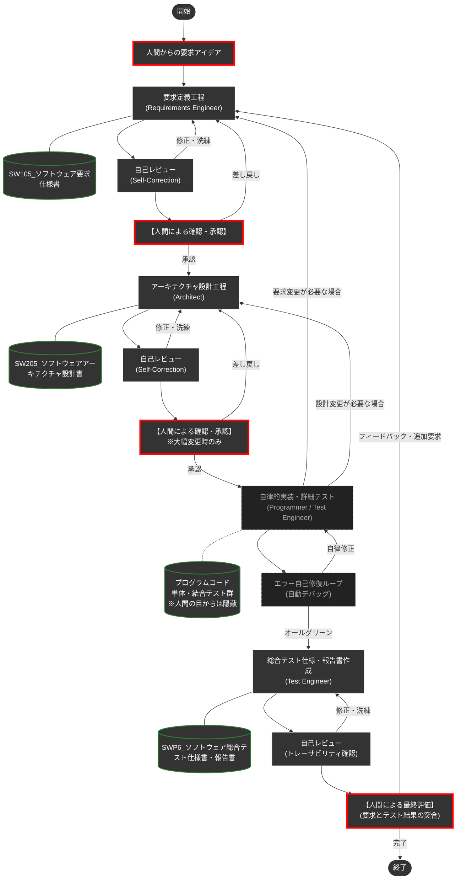

# スマートシーンのデモシステム開発プロジェクト

本プロジェクトは、以下の2件の目的があります。
（1）スマートシーンのデモシステム開発（APIはOSDVI公開資料を活用）
（2）Antigravityでのagent codingの開発プロセス（DADAと命名）の実験

デモシステムは、XPENGの「スマートシーン」に触発されて作成しました。XPENGは、ユーザが「車両条件が成立したとき、車両の一部機能を動かす」ことを許可しています。例えば、「雨が降ってきたら、ワイパーを動かすだけでは無く、デフォロスタやデフォッガを動かして曇り止めをする」という動作などを、ユーザが作り込めるようになっています。

さて、このように車両条件を調べたり、ワイパーなどを操作するためには、それらの情報にアクセスし制御するAPIが公開されている必要があります。OSDVI（Open SDV Initiative）は、APIの標準化を進めています。このデモシステムは、OSDVIの公開資料（https://www.nces.i.nagoya-u.ac.jp/osdvi/index.html ）に基づいて、クルマを操作します。このデモシステムの開発を、DADAプロセスの開発と共に行いました。

**注意**：開発途中にDADAプロセスを何度も改訂しました。今後もDADAプロセスは改訂予定です。ですから、このリポジトリは、最新のDADAプロセスに準拠していない可能性があります。また、OSDVIのAPI仕様も変更される可能性があります。

**補足**：このデモシステムの開発において、作者は、プログラムコードを一切書いていません。すべて、DADAプロセスに従って、AIエージェントに作成させました。皆様のAIエージェントの活用の一助となれば幸いです。

---
👉 **[すぐに自分のPCでデモを動かしてみたい方はこちら（インストール・起動手順）へジャンプ](#-実行環境とインストール要件-環境構築)**
---

## 🌟 DADA (Document and Agent Driven Agile) 開発プロセスの実践

本システムの開発などを通じて、AIエージェント（Antigravity等）とのペアプログラミングにおける開発プロセスを体系化し、これを**「DADA (Document and Agent Driven Agile)」**と名付けました。AIを単なるコーディングアシスタントとしてではなく、要件定義からアーキテクチャ設計、実装、テスト仕様策定・実行までの全V字モデル工程をともに担う「優れたパートナー（要求エンジニア、アーキテクト、テストエンジニア）」として機能させる仕組みです。

DADAプロセスのAntigravity用テンプレートは、GitHubで公開しています。今後も改訂する予定なので、このデモシステム開発プロジェクトで使用した版から変更されている可能性があります。
https://github.com/yamaPiT/AntigravityTemplate


### 💥 従来のAgentic Codingの限界とDADAが提供する解決策
1. **記憶喪失（一時メモリの揮発性）**: 会話で決めた仕様や設計はAIのコンテキストウィンドウから押し出されて消滅します。
2. **ブラックボックス化**: AI内部の手順書は人間が制御やレビューできません。

**「コードではなく、ドキュメントを唯一の情報源（Single Source of Truth）にする」**
これが DADAプロセス の核となる解決策です。

### 🌟 DADAプロセスの圧倒的優位性
- **実装とテストの自律隠蔽カプセル化**: プログラミングや細かいテストはAI自律動作内に隠され、人間は要求仕様に適合した総合テストを評価するだけで済みます。
- **Single Source of Truth**: コード修正前には必ず設計書を更新し、仕様と実装の乖離を防ぎます。
- **高品質と低コストのハイブリッド制御**: ASDoQモデル等に基づく高品質なレビューと、トークン節約を両立します。

### 🗺️ DADA プロセス フロー図


### 📁 リポジトリ構成（エコシステム）
| ディレクトリ | 役割 | 主要な内容 |
| :--- | :--- | :--- |
| [`.agents/`](.agents/) | **エージェントの脳** | 工程別の専門スキル (`skills/`) と標準手順書 (`workflows/DADA-Process.md`) |
| [`docs/`](docs/) | **ナレッジ・ベース** | 開発ドキュメントのテンプレート、ASDoQ品質モデル、作業ガイドライン |
| [`doc/`](doc/) | **開発成果物** | 人間が確認するドキュメント (SW105要求仕様書、SW205設計書、SWP6テスト報告書) |
| [`.cursor/`](.cursor/) | **全体制御** | Antigravityエージェントが常に守るべき絶対ルール (`project-rules.mdc` 等) |

---

## ✨ スマートシーンのデモシステムの主な機能

* **イグニッション状態遷移**: START/STOPによるシステム全体（アクチュエータやシナリオエンジン）の稼働統制。
* **物理挙動のシミュレーション**: 窓の開閉モーター制御（3秒間での目標値追従）や、長押しによるマニュアル/オート開閉の切り替え。
* **高度なオーバーライド（手動介入）ロジック**: 自動制御中にドライバーが手動操作を行った際、システムが優先権を譲る「ドライバー・イン・ザ・ループ」の原則の実装。
* **エッジ検出によるシナリオ復帰**: 手動介入後も、環境条件（雨量など）が再成立した瞬間に自動制御へシームレスに復帰する最新の制御ロジック。
* **シナリオ・ビューア**: 要件定義（自然言語）とOSDVIが公開したAPI仕様書を併記し、Read-Onlyで表示。

## 🚀 搭載されているスマートシーン

1. **雨天時スマートシーン**: 雨量センサ（0〜100%）に連動し、窓の自動閉鎖、ワイパー動作、デフロスタ/デフォッガの自動起動を行います。雨が止むと元の状態に復元（RESTORE）します。
2. **サンキューハザード**: 走行中にウインカーを操作すると、レーンチェンジ後に自動でハザードが3秒間点滅し、周囲に感謝を伝えるシーケンスが発動します。

### 💡 スマートシーンの開発経緯と仕様書の連携について

* 搭載されているスマートシーンを作成する際に、例えば降雨量センサの名称などを設定するときには、OSDVIが [https://www.nces.i.nagoya-u.ac.jp/osdvi/index.html](https://www.nces.i.nagoya-u.ac.jp/osdvi/index.html) で公開している「Open SDV API バージョン202509α 発行：2025年9月30日」を参照しました。
* 実際には、それらの文書をAI（Gemini Web）に読み込ませた上で、要求仕様書と設計書を作成しました。要求仕様書と設計書を作成したAIは、Webブラウザから起動するGeminiであり、Antigravityのチャット欄のAIではありません。
* その理由は、開発当初にはAntigravityの使い方がよく分からず、AntigravityのAIに仕様書を読み込ませる方法が分からなかったからです。
* 今後は、`./doc` フォルダ下に仕様書を置いて、それをAIに参照させる指示を出せば、Antigravity内のAIで、新しいスマートシーンシナリオを作成できる可能性があります。
* なお、AIが仕様書から名前を引用しており、引用元の仕様書はルールエディタのルールにコメント記述されています。

---

## 📋 実行環境とインストール要件 (環境構築)

本システムを自分のパソコンで動かすには、以下のソフトを入れる必要があります。

* **Node.js (必須)**: Webアプリなどを動かすための土台です。
  [Node.js 公式サイト](https://nodejs.org/ja) を開き、**「LTS（推奨版: Recommended For Most Users）」** と書かれた緑色のボタンを押してダウンロードし、インストールしてください。（インストール中の設定はすべて次へでOKです）
* ※「3Dカーシミュレータ」を表示するための特殊なプログラムファイルなどは、後述の起動コマンドを実行した際に自動的に全て揃う仕組みになっています。個別に入れる必要はありません。

---

## 💻 起動方法１：通常のパソコンでお使いの方（おすすめ）

ここでは、GitHubやプログラミングの特別な知識がなくても動かせる手順を説明します。

**1. プログラムのダウンロードと解凍**
* 今見ているこの画面（GitHub）の右上にある **緑色の `<> Code`** というボタンをクリックし、一番下にある **`Download ZIP`** を選んでパソコンに保存します。
* 保存したZIPファイルを右クリックし、「**すべて展開**（または解凍）」を選んで、フォルダとして開きます。
  * ⚠️ **注意**: ZIPファイルを展開せずに中身を直接開こうとするとエラーになります。必ず「展開（解凍）」してください。

**2. 黒い画面（ターミナル・コマンドプロンプト）の準備**
* 解凍してできたフォルダ（`SmartScene-main` など）を開き、ファイルがたくさん並んでいる画面に行きます。
* **Windowsの方**: フォルダの上の枠（ファイルの場所・パスが表示されているアドレスバー）をクリックして文字を全部消し、そこに半角で `cmd` と入力してEnterキーを押すと、黒い画面が開きます。
* **Macの方**: フォルダを右クリックし、「フォルダにかかわる新規ターミナル」等を選んで画面を開きます。（または Spotlight検索で「ターミナル」を開き、`cd ` と打った後にフォルダをドラッグ＆ドロップしてEnterを押します）

**3. 起動コマンドの入力と実行**
* 開いた黒い画面に、以下のコマンドを **1行ずつ** コピーして貼り付け、Enterキーを押します。

```bash
npm install
```
> 💡 **少し時間がかかります**: パソコンの性能やネット回線によっては、文字がダァーっと流れて数分かかる場合がありますが、止まっていなければ正常です。焦らずお待ちください！（警告・WARNが出ても基本は無視して大丈夫です）

完了したら、次のコマンドを入力してEnterキーを押します。

```bash
npm run dev
```

**4. ブラウザで確認**
* 上記のコマンドを入れると `ready started server on ...` のような文字が出ます。これが表示されたら成功です！
* お使いのブラウザ（ChromeやEdge、Safariなど）を開き、上部のURLバーに **`http://localhost:3000`** と入力してEnterキーを押してください。スマートシーンのシミュレータ画面が表示されます！

---

## 💻 起動方法２：Google Antigravity をお使いの方（AI開発体験向け）

AIエージェントを活用したDADAプロセスそのものを体験したい方や、既にAntigravityをインストールされている方向けの手順です。
（※リポジトリのコードを独自に改変して保存したい場合以外は、GitHubのアカウントは不要です）

**【開発・AIへの指示を始める前の準備（APIキーの設定）】**
他者の方がクローンして実際にAIへ指示を出し、開発（DADAプロセスの体験）を行う場合、AIモデル自身を動かすための設定が必要です。以下の2点を設定してください。

1. **LLM（AI本体）のAPIキー設定（必須）**
   - Antigravity画面右上の歯車（設定）アイコンをクリックし、「API Provider」からご自身が利用したいAIモデル（Anthropic, OpenAI, OpenRouter等）を選択し、ご自身でお持ちのAPIキーを入力してください。
2. **context7 MCPサーバーの設定（強く推奨）**
   - AIが最新のライブラリ等のドキュメントを参照できるようにするため、`context7` の接続設定を推奨しています。
   - 詳しい手順は、このページ下部にある [👉 context7 (MCPサーバー) の設定について](#-context7-mcpサーバー-の設定について一般の方は不要) をご覧ください。

**1. リポジトリの読み込み（Clone）**
* ブラウザでこのGitHubページを開き、上部にある緑色の `Code` ボタンを押し、表示されるURL（`https://github.com/...`）をコピーします。
* Antigravityを起動し、起動した3つのウィンドウのうち**「Editor」ウィンドウ**を使用します。
* Editorウィンドウの左側にある**「ソース管理（Git）アイコン」**（枝分かれしたようなマーク）をクリックします。
* 表示されたサイドバーの中から**「リポジトリをクローンする (Clone Repository)」**ボタンを押下します。
* 画面上部に入力欄が表示されるので、先ほどコピーしたURLを貼り付けてEnterキーを押し、保存先のフォルダを指定するとファイル一式が読み込まれます。

**2. 起動コマンドの実行**
* Editorウィンドウの上部メニューから `Terminal`（ターミナル）→ `New Terminal`（新しいターミナル）を開きます。
* 画面下部に開いたターミナル（黒い画面）に以下のコマンドを1行ずつ入力し、Enterキーを押します。

```bash
npm install
npm run dev
```

**3. シミュレータの表示**
* 起動に成功すると、Editorウィンドウ右側の「Browser（ブラウザ）」タブ、またはご自身のWebブラウザ（http://localhost:3000）でシミュレータが操作可能になります。

---

## 🤖 詳細：AIエージェントとの協調開発（DADA V字モデルプロセス）

本プロジェクトでは、コードの品質と設計の整合性を保つため、体系化された「DADA (Document and Agent Driven Agile) プロセス」に則って作業を進める仕組みがあります。


### 具体的な開発手順（DADAプロセスの利用）
Antigravityのチャットウィンドウで機能の追加や修正を依頼する際は、必ず**文の先頭に `/DADA-Process` と入力**してください。

**入力例：**
> `/DADA-Process 〇〇機能を追加してください。`

このコマンドを入力することで、AI（ハル）が以下の「DADA V字モデル標準プロセス」を自動的に遵守して作業を進めます。各工程には専門のエージェントスキルが割り当てられ、作成とASDoQ準拠の厳格なレビューがセットで行われます。

1. **要求定義フェーズ**: `requirements-engineer`による要件定義と、`requirements-reviewer`による目的適合性のレビュー（SW105作成）。
2. **アーキテクチャ設計フェーズ**: `architect`による設計と、`architecture-reviewer`による保守性・整合性のレビュー（SW205作成）。
3. **実装フェーズ**: `programmer`によるコード実装（必須リッチコメント含む）と、`code-review`による品質・保守性のレビュー。
4. **テスト・検証フェーズ**: `test-engineer`による要件対応マトリクス作成（SWP6）とテスト実行、`test-reviewer`による結果品質のレビュー。

※全工程を通じて、ドキュメントのASDoQ準拠を保証するための共通スキル `asdoq-compliance` が活用されます。

### 🌟 搭載されているエージェントスキルとワークフロー
本プロジェクトでは開発の各フェーズを専門的にサポートするため、以下のスキル群とワークフローが組み込まれています。チャットウィンドウから個別に呼び出して活用することも可能です。

#### ワークフロー (`.agents/workflows/`)
* **`/DADA-Process`**: DADA V字モデル標準開発プロセスを起動します。
* **`/generate-unit-tests`**: 実装した機能に対するユニットテストを自律的に生成します。

#### エージェントスキル (`.agents/skills/`)
* **要求フェーズ**: `requirements-engineer` (作成), `requirements-reviewer` (レビュー)
* **設計フェーズ**: `architect` (作成), `architecture-reviewer` (レビュー)
* **実装フェーズ**: `programmer` (実装), `code-review` (レビュー)
* **テストフェーズ**: `test-engineer` (作成・実行), `test-reviewer` (レビュー)
* **共通スキル**: `asdoq-compliance` (ASDoQ文書品質基準の適合チェック)

---

## 📁 主要ファイルとルールの設定変更

本プロジェクトには、AIエージェントの振る舞いを定義する各種ファイルが含まれており、GitHubからプルしてエディタを開いた時点で**自動的に環境に適応**されます。

* **ワークフロー**: `.agents/workflows/`
* **スキル**: `.agents/skills/`
* **基本ルール**: `.cursor/rules/project-rules.mdc` (AIの絶対ルール・MDC形式)

### 💡 ペルソナ（登場人物）のカスタマイズについて
AIが必ず日本語で回答することや、常にADAプロセス（プロジェクトルール・開発文書）に従って開発を進めることなどの基本ルールは、新たに設けられた `.cursor/rules/project-rules.mdc` に定義されています。Antigravityなどの互換エディタは自動的にこのMDC（Markdown Cursor）形式のルールを参照し続けます。

デフォルトでは、DADAプロセスの検証と実践のため、**「ユーザー名：マサ、AI名：ハル」**という個人的なペルソナが固定で設定されています。

このリポジトリを使う他者（ご自身）の名前や好みのAI名で開発を進めたい場合は、エディタで `.cursor/rules/project-rules.mdc` を開き、以下の該当箇所をご自身の名称に書き換えてください。

```markdown
私の名前は[あなたの名前]（Product Owner）です。あなたは優秀なテクニカルパートナーの「[好きなAIの名前]」です。
[あなたの名前]に対しては技術的なパートナーとして最大限の敬意を持ちつつ...
```

---

## 🔌 context7 (MCPサーバー) の設定について（※一般の方は不要）

このリポジトリでは、AIエージェントが最新のライブラリのドキュメントを自律的に参照して開発を進められるよう、`context7` という外部の仕組み（MCPサーバー）を利用する設定が含まれています。

> 💡 **初学者・一般の方へ（本設定は完全不要です！）**  
> このデモシステムを「ただパソコンで動かして体験するだけ」であれば、**ここから下の設定は一切不要です。無視してそのままご利用ください。**  
> （間違って設定しようとして迷う必要はありません！）

もし「AI駆動開発（DADAプロセス）を自分でもやってみたいが、設定難易度が高い」という方は、事前準備としてエディタ内にある `.\.cursor\rules\use-context7-for-docs.mdc` というファイルを「右クリック → 削除」するだけで、面倒な設定なしに通常のAI開発をスタートできます。

### (1) context7 API Keyの取得
* [https://context7.com/](https://context7.com/) にGoogleアカウントなどでサインインする。
* 上部の `More...` メニュー内に `Create API Key` があるので、そこでAPI Keyを作成してコピーする。

### (2) AntigravityでのMCPサーバー設定
* Antigravity画面右上の三点ドットから `MCP Servers` を選択し、`View raw config` を選択する。
* 以下のように作成または追記する。`YOUR_API_KEY` に、先ほど取得したキーを入力する。

```json
{
  "mcpServers": {
    "context7": {
      "command": "npx",
      "args": ["-y", "@upstash/context7-mcp", "--api-key", "YOUR_API_KEY"]
    }
  }
}
```

---

## 📄 ドキュメントとプロセスガイドライン

本システムの詳細な要求・アーキテクチャ仕様、テスト計画、および開発プロセス規則の原典については、以下のドキュメント群（ASDoQ品質モデル準拠）を参照してください。

* `docs/process/dada_document_guidelines.md` (DADAプロセスの公式ドキュメントおよびコードコメント規約)
* `doc/SW105_ソフトウェア要求仕様書.md` (要件ID・検証条件定義)
* `doc/SW205_ソフトウェアアーキテクチャ設計書.md` (コンポーネント・インターフェース設計定義)
* `doc/SWP6_ソフトウェア総合テスト仕様書・報告書.md` (要件トレーサビリティおよびテスト実行結果)

---
*Created and Maintained by Masa & Hal*
