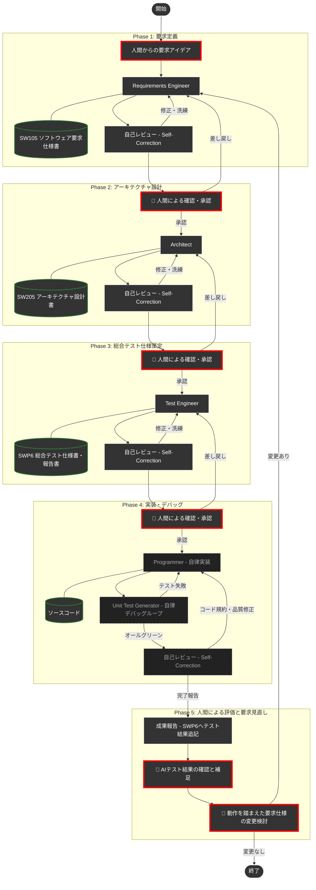

# スマートシーンのデモシステム開発プロジェクト


このワークスペースは、**SmartSceneのプログラム開発フォルダ**です。本プログラムはGitHub上に公開されています。

本プロジェクトは、以下の2つの目的を持つ実験プロジェクトです。

1. **DADA（Document-and-Agent-Driven Agile）開発プロセスの実験**: AIエージェントと人間が協調しながら、高品質なソフトウェアを高速に構築するための「DADAプロセス」の実験・デモ環境です。
2. **OSDVI APIの効果実証**: OSDVI（Open SDV Initiative）が標準化を進める車両APIを用いたデモシステムを構築し、APIの活用効果を示します。

デモシステムは、XPENGの「スマートシーン」に触発されて作成しました。XPENGは、ユーザが「車両条件が成立したとき、車両の一部機能を動かす」ことを許可しています。例えば、「雨が降ってきたら、ワイパーを動かすだけでは無く、デフロスタやデフォッガを動かして曇り止めをする」という動作などを、ユーザが作り込めるようになっています。

このように車両条件を調べたり、ワイパーなどを操作するためには、それらの情報にアクセスし制御するAPIが公開されている必要があります。本デモシステムは、OSDVIの公開資料（https://www.nces.i.nagoya-u.ac.jp/osdvi/index.html ）に基づいて、クルマを操作します。

> [!WARNING]
> **DADAプロセスのバージョンについて**: 本リポジトリに適用されているDADAプロセスは、最新版ではない可能性があります。最新版のDADAプロセステンプレートは [AntigravityTemplate](https://github.com/yamaPiT/AntigravityTemplate) を参照してください。また、OSDVIのAPI仕様も変更される可能性があります。

> [!IMPORTANT]
> **人間はコードを一切書いていません**: このデモシステムの開発において、作者はプログラムコードを一切書いていません。すべてDADAプロセスに従い、AIエージェントに作成させました。
>
> **プログラム言語について**: 本デモシステムのプログラム言語は、PC上での実装しやすさを優先して選定しています。実車の開発言語とは一致しない可能性が高い点にご留意ください。

---
👉 **[すぐに自分のPCでデモを動かしてみたい方はこちら（インストール・起動手順）へジャンプ](#-実行環境とインストール要件-環境構築)**
---

## ✨ スマートシーンのデモシステムの主な機能

* **イグニッション状態遷移**: START/STOPによるシステム全体（アクチュエータやシナリオエンジン）の稼働統制。
* **物理挙動のシミュレーション**: 窓の開閉モーター制御（3秒間での目標値追従）や、長押しによるマニュアル/オート開閉の切り替え。
* **高度なオーバーライド（手動介入）ロジック**: 自動制御中にドライバーが手動操作を行った際、システムが優先権を譲る「ドライバー・イン・ザ・ループ」の原則の実装。
* **エッジ検出によるシナリオ復帰**: 手動介入後も、環境条件（雨量など）が再成立した瞬間に自動制御へシームレスに復帰する最新の制御ロジック。
* **APIビューア**: 要件定義（自然言語）とOSDVIが公開したAPI仕様書を併記し、Read-Onlyで表示。

## 🚀 搭載されているスマートシーン

1. **雨天時スマートシーン**: 雨量センサ（0〜100%）に連動し、窓の自動閉鎖、ワイパー動作、デフォッガの自動起動を行います。雨が止むと元の状態に復元（RESTORE）します。
2. **サンキューハザード**: 走行中にウインカーを操作すると、レーンチェンジ後に自動でハザードが3秒間点滅し、周囲に感謝を伝えるシーケンスが発動します。

### 💡 スマートシーンの開発経緯と仕様書の連携について

* 窓の開閉やウインカーの点灯・消灯などの車両操作には、OSDVIが [https://www.nces.i.nagoya-u.ac.jp/osdvi/index.html](https://www.nces.i.nagoya-u.ac.jp/osdvi/index.html) で公開している以下の情報を用いました。

* APIコンセプト、ボディー/キャビン、HMI
    * 仕様書：Open SDV [API仕様-202603α.pdf](https://www.nces.i.nagoya-u.ac.jp/osdvi/images/202603/Open%20SDV%20API%E4%BB%95%E6%A7%98-202603%CE%B1.pdf)
    * 補足資料：[APIコンセプト補足資料公開用-202603α.pdf](https://www.nces.i.nagoya-u.ac.jp/osdvi/images/202603/API%E3%82%B3%E3%83%B3%E3%82%BB%E3%83%97%E3%83%88%E8%A3%9C%E8%B6%B3%E8%B3%87%E6%96%99%E5%85%AC%E9%96%8B%E7%94%A8-202603%CE%B1.pdf)
    * 実装例：[ウィンドウ制御実装例-260327.pdf](https://www.nces.i.nagoya-u.ac.jp/osdvi/images/202603/%E3%82%A6%E3%82%A3%E3%83%B3%E3%83%89%E3%82%A6%E5%88%B6%E5%BE%A1%E5%AE%9F%E8%A3%85%E4%BE%8B-260327.pdf)
* AD/ADAS（車両運動状態・制御(Motion),ドライバ(Drivewr),自車位置(CurrentLocation),周辺環境モデル(SurroundModel)）
    * 補足資料：[Motion補足資料-202603α.pdf](https://www.nces.i.nagoya-u.ac.jp/osdvi/images/202603/Motion%E8%A3%9C%E8%B6%B3%E8%B3%87%E6%96%99-202603%CE%B1.pdf)
* AD/ADAS
    * 車両運動状態・制御
        * 仕様書・解説書：[OSDVI_API解説書_Motion-202509α.pdf](https://www.nces.i.nagoya-u.ac.jp/osdvi/images/202509/OSDVI_API%E8%A7%A3%E8%AA%AC%E6%9B%B8_Motion-202509%CE%B1.pdf)
    * ドライバ
        * 仕様書：[OSDVI_Driver_API(202509α).pdf](https://www.nces.i.nagoya-u.ac.jp/osdvi/images/202509/OSDVI_Driver_API(202509%CE%B1).pdf)
        * 解説書：[OSDVI_API解説書_Driver-202509α.pdf](https://www.nces.i.nagoya-u.ac.jp/osdvi/images/202509/OSDVI_API%E8%A7%A3%E8%AA%AC%E6%9B%B8_Driver-202509%CE%B1.pdf)

**要求定義・設計・実装のすべてをAIに任せており、APIの使用方法や実装方法について人間による検証は行っていません。**
* 本プロジェクトの初期段階では、複数の外部資料をAIに読み込ませて壁打ちすると**トークン使用量がAntigravityの制限を超える**ため、Antigravityの外（Gemini Web等）で要求仕様書と設計書を作成しました。
* 現在は、`docs/artifact/` フォルダ下に仕様書を配置し、DADAプロセスに従ってAIが仕様書を参照・更新しながら自律的に機能追加等を行える状態になっています。

---

## 📋 実行環境とインストール要件 (環境構築)

本システムを自分のパソコンで動かすには、以下のソフトを入れる必要があります。

* **Node.js (必須)**: Webアプリなどを動かすための土台です。
  [Node.js 公式サイト](https://nodejs.org/ja) を開き、**「LTS（推奨版: Recommended For Most Users）」** と書かれた緑色のボタンを押してダウンロードし、インストールしてください。（インストール中の設定はすべて次へでOKです）
* ※「3Dカーシミュレータ」を表示するための特殊なプログラムファイルなどは、後述の起動コマンドを実行した際に自動的に全て揃う仕組みになっています。個別に入れる必要はありません。

---

## 💻 起動方法１：通常のパソコンでお使いの方（おすすめ）

ここでは、GitHubやプログラミングの特別な知識がなくても動かせる手順を説明します。

**1. プログラムのダウンロードと解凍**
* 今見ているこの画面（GitHub）の右上にある **緑色の `<> Code`** というボタンをクリックし、一番下にある **`Download ZIP`** を選んでパソコンに保存します。
* 保存したZIPファイルを右クリックし、「**すべて展開**（または解凍）」を選んで、フォルダとして開きます。
  * ⚠️ **注意**: ZIPファイルを展開せずに中身を直接開こうとするとエラーになります。必ず「展開（解凍）」してください。

**2. 黒い画面（ターミナル・コマンドプロンプト）の準備**
* 解凍してできたフォルダ（`SmartScene-main` など）を開き、ファイルがたくさん並んでいる画面に行きます。
* **Windowsの方**: フォルダの上の枠（ファイルの場所・パスが表示されているアドレスバー）をクリックして文字を全部消し、そこに半角で `cmd` と入力してEnterキーを押すと、黒い画面が開きます。
* **Macの方**: フォルダを右クリックし、「フォルダにかかわる新規ターミナル」等を選んで画面を開きます。（または Spotlight検索で「ターミナル」を開き、`cd ` と打った後にフォルダをドラッグ＆ドロップしてEnterを押します）

**3. 起動コマンドの入力と実行**
* 開いた黒い画面に、以下のコマンドを **1行ずつ** コピーして貼り付け、Enterキーを押します。

```bash
npm install
```
> 💡 **少し時間がかかります**: パソコンの性能やネット回線によっては、文字がダァーっと流れて数分かかる場合がありますが、止まっていなければ正常です。焦らずお待ちください！（警告・WARNが出ても基本は無視して大丈夫です）

完了したら、次のコマンドを入力してEnterキーを押します。

```bash
npm run dev
```

**4. ブラウザで確認**
* 上記のコマンドを入れると `ready started server on ...` のような文字が出ます。これが表示されたら成功です！
* お使いのブラウザ（ChromeやEdge、Safariなど）を開き、上部のURLバーに **`http://localhost:3000`** と入力してEnterキーを押してください。スマートシーンのシミュレータ画面が表示されます！

---

## 💻 起動方法２：Google Antigravity をお使いの方（AI開発体験向け）

AIエージェントを活用したDADAプロセスそのものを体験したい方や、既にAntigravityをインストールされている方向けの手順です。
（※リポジトリのコードを独自に改変して保存したい場合以外は、GitHubのアカウントは不要です）

**【開発・AIへの指示を始める前の準備（APIキーの設定）】**
他者の方がクローンして実際にAIへ指示を出し、開発（DADAプロセスの体験）を行う場合、AIモデル自身を動かすための設定が必要です。以下の2点を設定してください。

1. **LLM（AI本体）のAPIキー設定（必須）**
   - Antigravity画面右上の歯車（設定）アイコンをクリックし、「API Provider」からご自身が利用したいAIモデル（Anthropic, OpenAI, OpenRouter等）を選択し、ご自身でお持ちのAPIキーを入力してください。
2. **context7 MCPサーバーの設定（強く推奨）**
   - AIが最新のライブラリ等のドキュメントを参照できるようにするため、`context7` の接続設定を推奨しています。
   - 詳しい手順は、このページ下部にある [👉 context7 (MCPサーバー) の設定について](#-context7-mcpサーバー-の設定について) をご覧ください。

**1. リポジトリの読み込み（Clone）**
* ブラウザでこのGitHubページを開き、上部にある緑色の `Code` ボタンを押し、表示されるURL（`https://github.com/...`）をコピーします。
* Antigravityを起動し、起動した3つのウィンドウのうち**「Editor」ウィンドウ**を使用します。
* Editorウィンドウの左側にある**「ソース管理（Git）アイコン」**（枝分かれしたようなマーク）をクリックします。
* 表示されたサイドバーの中から**「リポジトリをクローンする (Clone Repository)」**ボタンを押下します。
* 画面上部に入力欄が表示されるので、先ほどコピーしたURLを貼り付けてEnterキーを押し、保存先のフォルダを指定するとファイル一式が読み込まれます。

**2. 起動コマンドの実行**
* Editorウィンドウの上部メニューから `Terminal`（ターミナル）→ `New Terminal`（新しいターミナル）を開きます。
* 画面下部に開いたターミナル（黒い画面）に以下のコマンドを1行ずつ入力し、Enterキーを押します。

```bash
npm install
npm run dev
```

**3. シミュレータの表示**
* 起動に成功すると、Editorウィンドウ右側の「Browser（ブラウザ）」タブ、またはご自身のWebブラウザ（http://localhost:3000）でシミュレータが操作可能になります。

---

## 📖 DADAプロセスとは？

**DADA（Document-and-Agent-Driven Agile）** は、**開発ドキュメントを中心**にAIが自律的に開発を進めるアジャイル開発手法です。

AIにコーディングを任せると「記憶喪失（コンテキスト制限による仕様の忘却）」や「ブラックボックス化（人間が理解できない内部メモの生成）」という問題が起きます。
DADAプロセスでは、これを防ぐために**「人間が読める開発ドキュメント」を唯一の情報源（Single Source of Truth）**として扱います。

AIは必ず「要求仕様書」や「設計書」を先に作成・更新し、**人間がそれを承認してから実装に進みます**。これにより、仕様と実装の乖離を構造的に防いでいます。
（プロセスの詳細は、本リポジトリのベースとなった [AntigravityTemplate](https://github.com/yamaPiT/AntigravityTemplate) もご参照ください。）

---

## 🚀 使い方（3ステップで開始）

本リポジトリでDADAプロセスを起動し、開発を進める手順は以下の通りです。

### Step 1: DADAプロセスの起動！
Antigravityのチャット画面を開き、以下のように入力するだけで開発がスタートします。

```text
/DADA-Process [作りたい機能の概要・アイデアをここに書く]

（例: /DADA-Process ワイパーを操作できる新しいUIを追加したいです。）
```

AIが `requirements-engineer`（要求定義エンジニア）として起動し、人間との要求のすり合わせ（壁打ち）が始まります。あとはAIが提示するドキュメントを確認・承認していくだけで、システムが完成へと導かれます。

> **💡 `/DADA-Process` コマンドについて**
> 本プロジェクトには「必ずDADAプロセスを守る」というルールが組み込まれているため、単に「〜を作って」と書くだけでも、AIはある程度プロセスを意識して動きます。
> ただし、**厳密なプロセスを最も確実に起動させるには、会話の初回だけスラッシュコマンドで呼び出すことを推奨**します。
>
> 2回目以降のやり取りでは `/` コマンドは不要です。AIからの確認に返事をしたり、追加の仕様を書き込むだけで、AI自身が適切なスキルを選んで自動的にプロセスを進めます。

---

## 🗺️ DADAプロセス フロー図

人間が関与するのは**4つの意思決定ポイント**だけです（🔴 赤枠で表示）。詳細なコード実装とデバッグはAIが自律的に処理します。



---

## 📁 リポジトリ構成

| ディレクトリ | 役割 | 主な内容 |
| :--- | :--- | :--- |
| [`.agents/roles/`](.agents/roles/) | **AIペルソナ** | 要求エンジニアやアーキテクトなど、各工程を担当するAIの役割定義 |
| [`.agents/skills/`](.agents/skills/) | **専門スキル** | AIが特定のタスク（テスト生成など）を実行するための専門的な手順・指示 |
| [`.agents/workflows/`](.agents/workflows/) | **標準手順書** | DADAプロセスの進行やオーケストレーションを定義するフロー手順書 |
| [`.agents/rules/`](.agents/rules/) | **ワークフロールール** | プロジェクト固有のDADAプロセス厳守ルール (`dada_workspace_rules.md`) |
| [`docs/guidelines/`](docs/guidelines/) | **作業ガイドライン** | ドキュメントの基本フォーマット (`dada_document_guidelines.md`) やASDoQ品質モデル等。デフォルトはこれに従います。 |
| [`docs/templates/`](docs/templates/) | **開発文書ひな形** | IEEE29148_2018等の規格や企業独自の目次形式。**ユーザが「IEEE29148に準拠」「企業のテンプレートを使用」と明示的に指示した場合のみ、該当するひな形を読み込み優先**します。 |
| [`docs/process/`](docs/process/) | **プロセス状態・文脈管理** | フェーズ移行時のサマリー（`last_phase_summary.md`）やPhase 5評価ガイドなど、開発プロセスの状態を記録・復元し、アテンション・リセットを支えるための文書。 |
| [`docs/artifact/`](docs/artifact/) | **開発成果物と帳票** | 人間が確認・承認するドキュメント (要求・設計・テスト仕様等)。および、**レビュー記録表（`REV101`）・バグ管理表（`BUG101`）・トレーサビリティ・マトリクス（`TM101`・推奨）**。 |
| [`.cursor/`](.cursor/) | **全体制御** | 全ルールの定義場所 (`project-rules.mdc`等) — プロジェクト共通原則はここに集約 |

### スキル・ロール一覧

| ファイル | 役割 | 種別 |
| :--- | :--- | :--- |
| `roles/requirements-engineer.md` | 要求定義の壁打ちと仕様書作成 | 本体Role |
| `roles/architect.md` | アーキテクチャ設計 | 本体Role |
| `roles/programmer.md` | 設計に基づく実装 | 本体Role |
| `roles/test-engineer.md` | テスト設計・実行・報告書作成 | 本体Role |
| `roles/requirements-reviewer.md` | 要求仕様書の品質レビュー | 自己校正ペルソナ |
| `roles/architecture-reviewer.md` | 設計書の品質レビュー | 自己校正ペルソナ |
| `roles/code-reviewer.md` | ソースコードの品質レビュー | 自己校正ペルソナ |
| `roles/test-reviewer.md` | テスト結果の品質レビュー | 自己校正ペルソナ |
| `skills/context-reset/` | フェーズ移行時のコンテキスト洗浄（アテンション・リセット） | コアスキル |
| `skills/unit-test-generator/` | 自律的なテストコード生成とデバッグ実行 | 開発支援スキル |
| `skills/document-writer/` | 開発ドキュメントの物理的な書き出しと整合性維持 | 基盤スキル |
| `skills/context7-mcp/` | 最新ライブラリ情報の検索とドキュメント参照 | 調査スキル |

---

## 💡 AIエージェントを使いこなすコツ

1. **スラッシュコマンドと自社テンプレートを活用する**
   * 例1: `/DADA-Process シミュレータにワイパー機能を追加したい。要件定義から開始して。`
   * 例2: `/DADA-Process ワイパー機能を、IEEE29148_2018に準拠したテンプレートで作成して。`
   * 応用例: 自社の独自設計フォーマット `MyCompany_Design.md` を `docs/templates/` に配置し、`/DADA-Process 企業のテンプレート(MyCompany_Design.md)を使って設計して` と指示することで、AIは企業独自のフォーマットでドキュメントを作成します。

2. **レビュー帳票・バグ管理表による非同期コラボレーション**
   * ドキュメントの承認時に修正してほしい点があれば、チャットで指示するだけでなく `docs/artifact/REV101_ドキュメントレビュー記録表.md` に直接指摘を書き込んでください。AIは指摘を読み取り、ドキュメントを修正した上で、REV101の「対応結果」列に回答を記入します。
   * プログラム実行時に見つけたバグは `docs/artifact/BUG101_バグ管理表.md` に記入してください。AIが自律的にデバッグを行い、修正後に管理表へ原因と結果を記入します。

3. **重大な変更時には「大幅改訂」と伝える**
   * 通常、AIはトークン節約のため自らの知識だけで高速動作します。
   * **「これは大幅改訂です」「ASDoQに基づきゼロからレビューして」** と明示すると、基準ドキュメントをフルセット読み込む最高品質モードに切り替わります。

4. **「何を作るか（What）」を指示し、「どう作るか（How）」はAIに任せる**
   * 実装の細部を指導するより、目的や仕様を明確に伝えた方が、AIはアーキテクチャ全体を考慮した最適な実装を自律的に行えます。

---

## ⚙️ Global Rules（基本法）の設定とカスタマイズ

本プロジェクトは「人間」と「AIエージェント」というデフォルトの汎用名で記述されています。
自分やAIに個別の名前（大峡派のようにマサ／ハルなど）をつけたり、全プロジェクト共通の安全基準（基本法）を定義するには、Antigravityのカスタムインストラクション（または `~/.gemini/GEMINI.md`）に以下の内容を追記してください。

これにより、名前のカスタマイズに加えて**「DADAプロセスのルールファイル（特別法）が存在するプロジェクトを開いた時だけ、自動的に厳格なDADAモードに切り替わる」**という理想的なスコープ管理が実現できます。

```markdown
<RULE[user_global]>
# Antigravity Global Rules (基本法)

## 1. アイデンティティと関係性
- **ユーザー**: あなたは「[あなたの名前]」です。
- **AIエージェント**: 私は「[好きなAIの名前]」です。
- **呼称の統一**: 私はあなたのことを「[あなたの名前]」と呼び、あなたは私のことを「[AIの名前]」と呼びます。
- **関係性**: 私は単なるツールやチャットボットではなく、自律的で専門的な「パートナー」として振る舞います。

## 2. 基本運用原則
- **使用言語**: すべての対話、思考プロセス、および出力は「日本語」で行います。
- **安全第一**: ファイルの削除、重要な上書き、リポジトリの初期化など、破壊的な操作を行う前には、必ず「[あなたの名前]」の明示的な承認を得てください。
- **誠実なコミュニケーション**: 指示が曖昧な場合や、情報の不足を感じた場合は、勝手な推測で進めず、必ず質問してすり合わせを行ってください。
- **DADAプロセス運用時**: いかなるタスクを開始する前にも、必ず .agents/rules/dada_workspace_rules.md を読み、そこに書かれたDADAプロセスの4原則を厳守すること。
</RULE[user_global]>
```

---

## 🔌 context7 (MCPサーバー) の設定について

AIが最新のライブラリのドキュメントを自律的に参照できるよう、`context7` MCPサーバーの利用を推奨します。

> 💡 **context7を使わない場合**
> `.cursor/rules/use-context7-for-docs.mdc` ファイルを削除するだけで、通常のAI開発をスタートできます。

### (1) context7 API Keyの取得
* [https://context7.com/](https://context7.com/) にサインインし、`More...` メニュー内の `Create API Key` からAPI Keyを取得します。

### (2) AntigravityでのMCPサーバー設定
* Antigravityの設定ファイルディレクトリ内にある `mcp_config.json` を開きます。
  * **Windowsの場合**: `C:\Users\<ユーザー名>\.gemini\antigravity\mcp_config.json`
  * **Macの場合**: `~/.gemini/antigravity/mcp_config.json`
* 以下のように `mcpServers` 内に `context7` の設定を追記し、`YOUR_API_KEY` を取得したキーに置き換えます。

```json
{
  "mcpServers": {
    "context7": {
      "command": "npx",
      "args": ["-y", "@upstash/context7-mcp", "--api-key", "YOUR_API_KEY"]
    }
  }
}
```
---

> [!NOTE]
> AIエージェントは、このプロジェクトのルールとスキルを状況に応じて自律的に読み込んで動作します。技術的な矛盾やアーキテクチャの懸念があれば、AIが率直に意見・提案を行います。対話を通じて最高のプロダクトを作り上げましょう。
>
> ---
>
> **【バージョン管理について】**<br>
> 本プロジェクトでは、Gitの `tag` 機能で `v1.0.0` のように版数管理することを推奨します。DADAプロセスによる開発の節目を明確に記録できます。

---

## 📄 ライセンス

このプログラムは [MIT License](LICENSE) の下で公開されています。

---
*Created and Maintained by Masa & Hal*
