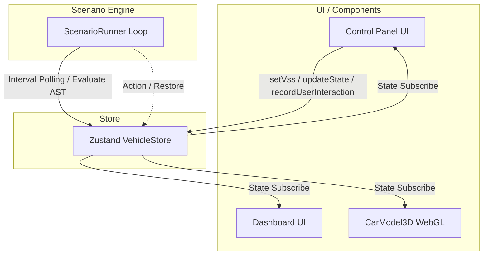

# (SW205) ソフトウェアアーキテクチャ設計書
**版数**: 1.2.0（DADAプロセス改定版）
**作成日**: 2026年3月31日
**作成者**: ハル (AIエージェント / Architect / Reviewer)

---

## 1. 概要
本設計書全体の前提事項を定義する。

### 1.1 目的と位置づけ
本書は、「OSDVIスマートシナリオプロトタイプシステム (Smart Scene Simulator)」のアーキテクチャを定義し、開発者間でシステム構造・データフロー・状態管理方針および実装技術の共通理解を図ることを目的とする。
本ドキュメントは、SW105（ソフトウェア要求仕様書）で定義された要件を満たすためのソフトウェアの「静的構造」と「動的振る舞い」を定義し、詳細設計および実装の入力となる。

### 1.2 適用範囲
本アーキテクチャ設計は、車載シミュレータのフロントエンド（SPA）全体を対象とする。

### 1.3 参照ドキュメント
* (SW105) ソフトウェア要求仕様書

### 1.4 用語定義
* **SPA**: Single Page Application
* **AST**: 抽象構文木。シナリオの実行論理（IF条件など）を構造化して定義するフォーマット。

---

## 2. システム構成
ハードウェアを含めたシステム全体におけるソフトウェアの立ち位置を定義する。

### 2.1 システム全体構成
該当システムは、外部の車両・ハードウェアには直接接続せず、ブラウザ上で独立して動作するSPA環境である。
以下にフロントエンド内部の全体構成図を示す。

### 2.2 主たるソフトウェア要素
本ソフトウェアは以下の技術で構成される。
* **フロントエンド・ルーティング**: Next.js (React)
* **3D描画エンジン**: Three.js / React Three Fiber (R3F) および Drei
* **状態管理**: Zustand
* **開発言語**: TypeScript (全レイヤー)

---

## 3. ソフトウェア構成（静的構造）
ソフトウェア内部のモジュール分割と依存関係を定義する。

### 3.1 ソフトウェア全体構成
対象ソフトウェアは「UI Layer（表示・操作）」「Data Layer（状態管理）」「Logic Layer（シナリオ評価）」の3層のレイヤ構造を採用し、各コンポーネントの役割を分離する。

### 3.2 機能ユニットの定義
* **UI / Components**: Reactベースの表示コンポーネント群（ダッシュボード、コントロールパネル、3Dモデル）
* **Store**: Zustandによるフロントエンドの状態コンテナ
* **Scenario Engine**: シナリオ条件の評価およびアクションのディスパッチャ（ScenarioRunner）

---

## 4. 制御方式（動的振る舞いとリソース割り当て）
システム全体を正しく稼働させるためのメカニズムを定義する。

### 4.1 メモリ構成とレイアウト
フロントエンド完結型システムであるため、ブラウザ（V8エンジン等）のメモリ・ヒープ領域に依存する。シミュレータの状態データはZustandストア内のオブジェクトツリーとしてメモリ上に保持される。

### 4.2 ソフトウェア制御方式（ライフサイクル・並行処理）
1. **ユーザー直観操作（UI発生）** -> UIレイヤから `setVss` を呼び出し、当該のアクチュエータへの手動介入フラグをONにする。同時に設定が `UserMemoryState` に意図として記録される。
2. **定期自動評価（Scenario Engine起動）** -> Logicレイヤ（ScenarioRunner）が非同期の100ms周期ループを開始し、ASTのIF条件が「成立した瞬間（エッジ検出）」に処理を発火する。実行直前に `PreRunStateCache` へ現状のスナップショットを保管したうえで、自動アクション（状態のバッチ更新）を実行する。
3. **継続または復元（RESTORE）** -> センサー値等により再びシナリオ条件を外れた場合、エンジンはRESTOREノードを実行し、キャッシュ（PreRunStateCache）または過去のユーザー設定記憶（UserMemoryState）へ状態を即時復元させたのち、サイクルの監視へ戻る。

### 4.3 性能見積り
100ms周期のポーリングおよびReactの更新サイクルにより、最大60fpsレートでのなめらかな再描画（レンダリング）が可能なスループットを維持する設計とする。

---

## 5. 機能ユニット詳細
各機能ユニット（モジュール）の責任範囲と検証条件を以下に定義する。

### 5.1 Store（状態管理層）
* **役割と責任**: VSS信号と内部状態（Internal変数）を一元管理し、状態取得と更新（`setVss`, `updateState`）のインターフェースを提供する。手動介入フラグ等の管理と調停機能も備える。
* **【検証条件】**: `setVss` インターフェースを介した状態更新時において、イグニッション状態（STOP）による初期化トリガーや、雨量変化のエッジ検出処理（副作用）が遅延なく即座の同一フレーム内で発火し、不整合な状態が生成されないこと。

### 5.2 Scenario Engine（シナリオ評価層: ScenarioRunner 等）
* **役割と責任**: Zustandストア上のAST定義シナリオツリーを100ms周期のエンジンループで再帰的に評価し、条件成立時のアクションを自動発行する。また、マニュアル介入フラグ（`ManualOverrideFlags`）を監視し手動操作に優先権を譲る制御を行う。
* **【検証条件】**: エンジンからStoreへのAction発行（状態更新命令）時において、対象アクチュエータに競合する手動操作のフラグが存在する場合、またはオーバーライド禁止期間（3000ms等）内である場合、エンジン側のAction命令のみが直ちに破棄（Reject）されること。

### 5.3 UI / Components（表示・操作層: ControlPanel, CarModel3D 等）
* **役割と責任**: 要求仕様書に基づく制御パネルの提供、およびStore状態のWebGL（3Dモデル）へのリアルタイム反映。
* **【検証条件】**: フロントエンド側のUIからのイベント発火からZustandのStore更新、および画面上（フル3Dモデルアニメーション含む）へのレンダリングまでが16ms（60fps）以内に完了し、ユーザー操作における不自然な遅延やモデルのチラつきを引き起こさないこと。

---

## 6. システムで扱うデータ
ソフトウェア全体で共有する主要なデータ構造を定義する。

### 6.1 データモデル（Store構成）
Storeは以下の構成・モデルを持つ。
* **VSS Mapped State**: `Vehicle.IgnitionState`, `Vehicle.Exterior.Air.RainIntensity`, `Vehicle.Cabin.Door.Row1.Left.Window.Position` など、実際の車載シグナル標準仕様（VSS）にマッピングされたデータ群。
* **Internal State**: シミュレータ固有の独自管理用ステータス群。
  * `Internal.UserMemoryState`: ユーザーの手動操作により意図された設定の保持先。
  * `Internal.ManualOverrideFlags`: ユーザーが操作したアクチュエータの排他フラグ。
  * `Internal.PreRunStateCache`: シナリオ自動制御の介入が推移する直前の車両スナップショット保存先。

---

## 7. 例外・異常処理一覧
シミュレータ動作におけるエラー回復手順の方針を定義する。

* **UI層のエラー（Error Boundary）**: 特定のコンポーネント（複雑な3Dキャンバスのレンダリング等）で致命的クラッシュが発生した場合でも、アプリケーション全体が道連れでダウンしないように Error Boundary を導入し、エラー部分のみを回復用UIへフォールバックさせる。
* **状態・シナリオエンジンのエラー**: シナリオASTの動的パース時、あるいはアクション実行中の予期せぬ状態遷移の不整合（存在しないターゲットキー指定・型不一致など）が発生した場合、例外をキャッチして安全に当該アクション処理のみをスキップ（破棄）し、基本となる全体システム（状態管理）の自律稼働を保ち続けるフェイルセーフな安全設計とする。

---

## 8. その他・特記事項
* **セキュリティ方針**: 教育用のクライアントサイド（SPA）単体シミュレータのため外部からの直接的なネットワーク攻撃等の脅威は想定しないが、ブラウザ標準のXSS保護やデータバインディングによる保護（React基本仕様）を用いて、ユーザー入力がスクリプトとして不適切に実行されない環境とする。

