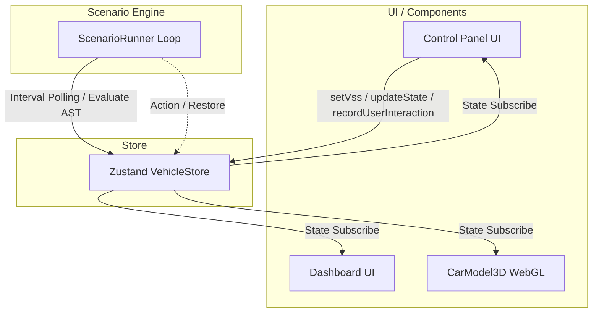

# SW205_ソフトウェアアーキテクチャ設計書
**版数**: 1.1.0（改定）
**作成日**: 2026年3月25日
**作成者**: ハル (AIエージェント / Architect / Reviewer)

---

## 1. 導入
### 1.1 目的
本書は、「OSDVIスマートシナリオプロトタイプシステム (Smart Scene Simulator)」のアーキテクチャを定義し、開発者間でシステム構造・データフロー・状態管理方針および実装技術の共通理解を図ることを目的とする。

### 1.2 対象範囲
車載シミュレータのフロントエンド（SPA）におけるアーキテクチャ全体。

### 1.3 参照する要求仕様書(SRS)
* SW105_ソフトウェア要求仕様書

---

## 2. システムアーキテクチャ
### 2.1 全体構成図

### 2.2 技術スタック
* **フロントエンド・ルーティング**: Next.js (React)
* **3D描画エンジン**: Three.js / React Three Fiber (R3F) および Drei
* **状態管理**: Zustand
* **言語**: TypeScript (全レイヤー)

---

## 3. コンポーネント設計
システムは大きく以下の3つのコンポーネント役割に分割される。

### 3.1 Store（状態管理層）
* **役割と責任**: VSS信号と内部状態（Internal変数）を一元管理し、状態取得と更新（`setVss`, `updateState`）のインターフェースを提供する。手動介入フラグ等の管理と調停機能も備える。
* **【検証条件】**: `setVss` インターフェースを介した状態更新時において、イグニッション状態（STOP）による初期化トリガーや、雨量変化のエッジ検出処理（副作用）が遅延なく即座の同一フレーム内で発火し、不整合な状態が生成されないこと。

### 3.2 Scenario Engine（シナリオ評価層: ScenarioRunner 等）
* **役割と責任**: Zustandストア上のAST定義シナリオツリーを100ms周期のエンジンループで再帰的に評価し、条件成立時のアクションを自動発行する。また、マニュアル介入フラグ（`ManualOverrideFlags`）を監視し手動操作に優先権を譲る制御を行う。
* **【検証条件】**: エンジンからStoreへのAction発行（状態更新命令）時において、対象アクチュエータに競合する手動操作のフラグが存在する場合、またはオーバーライド禁止期間（3000ms等）内である場合、エンジン側のAction命令のみが直ちに破棄（Reject）されること。

### 3.3 UI / Components（表示・操作層: ControlPanel, CarModel3D 等）
* **役割と責任**: 要求仕様書に基づく制御パネルの提供、およびStore状態のWebGL（3Dモデル）へのリアルタイム反映。
* **【検証条件】**: フロントエンド側のUIからのイベント発火からZustandのStore更新、および画面上（フル3Dモデルアニメーション含む）へのレンダリングまでが16ms（60fps）以内に完了し、ユーザー操作における不自然な遅延やモデルのチラつきを引き起こさないこと。

---

## 4. データアーキテクチャ
### 4.1 データモデル
Storeは以下の構成・モデルを持つ。
* **VSS Mapped State**: `Vehicle.IgnitionState`, `Vehicle.Exterior.Air.RainIntensity`, `Vehicle.Cabin.Door.Row1.Left.Window.Position` など、実際の車載シグナル標準仕様（VSS）にマッピングされたデータ群。
* **Internal State**: シミュレータ固有の独自管理用ステータス群。
  * `Internal.UserMemoryState`: ユーザーの手動操作により意図された設定の保持先。
  * `Internal.ManualOverrideFlags`: ユーザーが操作したアクチュエータの排他フラグ。
  * `Internal.PreRunStateCache`: シナリオ自動制御の介入が推移する直前の車両スナップショット保存先。

### 4.2 ライフサイクル
1. **ユーザー直観操作（UI発生）** -> `setVss` 呼び出しにより、当該のアクチュエータへの手動介入フラグがONになり、同時に設定が `UserMemoryState` に意図として記録される。
2. **定期自動評価（Scenario Engine起動）** -> 100ms周期で条件走査が行われ、ASTのIF条件が「成立した瞬間（エッジ検出）」に処理が発火する。実行直前に `PreRunStateCache` へ現状のスナップショットを保管したうえで、自動アクション（状態のバッチ更新）を実行する。
3. **条件外れ（シナリオ中断/RESTORE）** -> センサー値等により再びシナリオ条件を外れた場合、エンジンはRESTOREノードを実行し、キャッシュ（PreRunStateCache）または過去のユーザー設定記憶（UserMemoryState）へ状態を即時復元させたのち、シナリオサイクルを終了・クローズする。

---

## 5. 非機能設計
### 5.1 セキュリティ
* 教育用のクライアントサイド（SPA）単体シミュレータのため外部からの直接的なネットワーク攻撃等の脅威は想定しないが、ブラウザ標準のXSS保護やデータバインディングによる保護（React基本仕様）を用いて、ユーザー入力がスクリプトとして不適切に実行されない環境とする。

### 5.2 エラーハンドリング（フォールバック）方針
* **UI層のエラー（Error Boundary）**: 特定のコンポーネント（複雑な3Dキャンバスのレンダリング等）で致命的クラッシュが発生した場合でも、アプリケーション全体が道連れでダウンしないように Error Boundary を導入し、エラー部分のみを回復用UIへフォールバックさせる。
* **状態・シナリオエンジンのエラー**: シナリオASTの動的パース時、あるいはアクション実行中の予期せぬ状態遷移の不整合（存在しないターゲットキー指定・型不一致など）が発生した場合、例外をキャッチして安全に当該アクション処理のみをスキップ（破棄）し、基本となる全体システム（状態管理）の自律稼働を保ち続けるフェイルセーフな安全設計とする。
