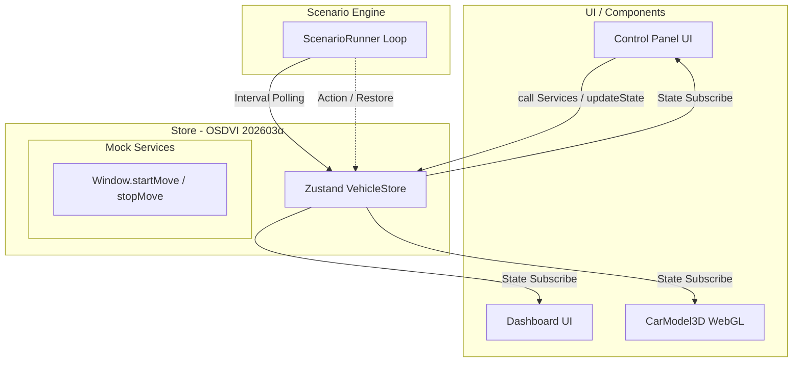

# (SW205) ソフトウェアアーキテクチャ設計書
**版数**: 2.0.0（202603α API対応・3Dアニメーション継承版）
**作成日**: 2026年4月8日
**作成者**: ハル (AIエージェント / Architect / Reviewer)

---

## 1. 導入
### 1.1 目的と位置づけ
本書は、「OSDVIスマートシーンデモシステム V2.0」のフロントエンド・アーキテクチャを定義する。
SW105（ソフトウェア要求仕様書）で定義された要件、特に「OSDVI 202603α版」への準拠と、既存の3D・GUI表現を安定的に維持・継承しつつ、状態管理（データ構造）を最新API仕様へ適合させるための静的構造と動的振る舞いを定義する。

### 1.2 適用範囲
シミュレータのフロントエンド（SPA）全体。外部のハードウェアには直接接続しない。

### 1.3 参照ドキュメント
* (SW105) ソフトウェア要求仕様書
* OSDVI API 仕様書類（SW105の「1.4 参考資料」に列挙の定義に基づく）

### 1.4 用語定義
* **SPA**: Single Page Application
* **Store**: Zustandによるフロントエンドの状態コンテナ
* **モック・サービスAPI**: OSDVI APIが規定するサービスやメソッド（`startMove()` など）をZustandのActionsとして模倣・代替実装したもの。

---

## 2. システムアーキテクチャ
### 2.1 システム構成図（全体像）
以下にフロントエンド内部の全体構成図とデータ・アクションのフローを示す。

### 2.2 技術スタック
* **フロントエンド**: Next.js (React), TypeScript
* **状態管理**: Zustand
* **3D描画**: React Three Fiber (R3F) / Three.js

---

## 3. コンポーネント設計
### 3.1 機能ユニットの役割と責任
1. **Data Layer (Store)**: 
   * 最新のOSDVI 202603αに基づくデータモデル（状態）を一元管理する。
   * インターフェース（ストア内関数）として、旧来のセッターに加え、`startMove()` などの**サービスコール抽象化**を提供する。
2. **UI / Components**: 
   * 既存のWebGL 3DアニメーションやGUI（ワイパースイッチ、窓開閉シークバー等）の見た目を完全維持し、Zustandストア経由でのイベントのみを新しいOSDVI対応に差し替える。
3. **Logic Layer (Scenario Engine)**:
   * シナリオ実行エンジンとしてAST（抽象構文木）を評価し、各種サービスコールをStore経由でディスパッチする。マニュアル介入の後勝ち調停もここを通じて実行される。

### 3.2 インターフェース境界での「検証条件」
* **Store ⇔ UI間**: 
  UI上の窓開度スライダーを操作したとき、直截な状態上書きではなくStore内の `startMove` が呼ばれ、内部タイマーまたは補間状態を通してGUIへ3Dアニメーション描画用の中間値が即時ブロードキャストされること。
* **Store ⇔ Logic間**:
  シナリオエンジンが自動制御イベント（例: 雨量10%エッジ検知）でアクションを発行する際、`Internal.ManualOverrideFlags` によって当該機能へのユーザー手動介入が検知された場合は、副作用なく更新がRejectされること。ただし、RESTORE処理（シナリオ終了時の原状復帰）においては、同フラグによるRejectをバイパスし、シナリオ開始前のキャッシュ（`PreRunStateCache`）から強制的に一括復元を行うこと。

---

## 4. データアーキテクチャ
### 4.1 データモデル（OSDVI 202603α 準拠マッピング）
Store内で管理するVSS（Vehicle Signal Specification）レイヤのデータキーを以下の通り定義する。

#### Mapped State (Signals)
* **イグニッション・環境**: 
  * `Vehicle.IgnitionState` ('STOP' | 'START')
  * `Vehicle.Exterior.Air.RainIntensity` (0-100)
* **車両運動 (Motion)**:
  * `Vehicle.Motion.ResponseProfile` ('Standard' | 'Maximum' | 'Rapid' | 'Gentle')
* **デフォッガ (Defogger)**:
  * `Vehicle.Exterior.Light.Defogger.IsActive` (boolean)
  * `Vehicle.Exterior.Light.Defogger.Mode` (PascalCaseのenum等)
* **ウィンドウ制御 (Window)**:
  * 旧来のパスから、マルチインスタンスの「$」プレフィックスへ変更する。
  * `Vehicle.Cabin.Window.$FrontLeft.Position`, `$FrontRight`, `$RearLeft`, `$RearRight` (0-100)

#### Internal State (アプリ独自ステータス)
* `Internal.PreRunStateCache`: シナリオ開始直前の状態（窓・ワイパー・デフォッガなど）をスナップショット保存する。シナリオ終了時のRESTOREにて参照・一回使用後に破棄して単発実行を保証する。
* `Internal.UserMemoryState` / `ManualOverrideFlags` : マニュアルオーバーライド判定用ステータス。

### 4.2 ライフサイクル（モック・サービス）
API更新による「メソッド・サービス化」に対応するため、ZustandのActionsに以下のインターフェースを実装する。

* **`startMove(instance: string, position: number, priority: number)`**
  * Store内でターゲットの位置をセットし、非同期で `WindowEventKindType`（制御中フラグ、TargetReached等）をステートとしてエミュレートする。
* **`stopMove(priority: number)`** / **`lock`** / **`unlock`**
  * 操作権限の制御。手動介入時にlockによる後勝ち調停などをシードする。

---

## 5. 非機能設計
### 5.1 エラーハンドリング・フォールバック
* **不正パラメータ境界丸め**: UIやシナリオエラー等で窓開度が `120` 等で要求された場合、Zustandのセッター内で `Max/Min` で丸めるか、OSDVIエラーを模した結果ログ（内部状態 `LastErrorCode` 等）を出力しクラッシュを防ぐ。
* **状態復元のフェールセーフ**: `PreRunStateCache` による雨天復旧（RESTORE）にてキャッシュが欠損していた場合は、安全値（窓0%、ワイパーOFF等）へ強制フォールバックしてシステムダウンを防ぐ。

### 5.2 セキュリティ
* シナリオエンジン等からevalによる動的実行は行わず、ツリー評価（ASTのパーサ構築）の形式を保つことでXSSを本質的に排除する。

---
