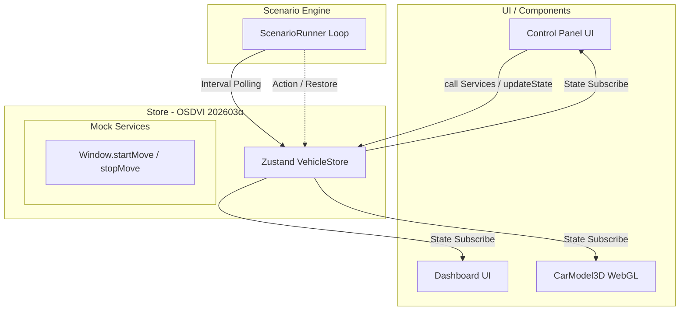

# (SW205) ソフトウェアアーキテクチャ設計書

版数: 4.0.0（DADAプロセスガイドライン準拠・完全トレーサビリティ版）
作成日: 2026年5月8日
作成者: ハル (AIエージェント / Architect / Reviewer)

---

## 1. 概要

### 1.1 目的と位置づけ
本書は、「OSDVIスマートシーンデモシステム V2.0」のアーキテクチャを定義する。
SW105（ソフトウェア要求仕様書）で定義された要件、特に「OSDVI 202603α版」への準拠（REQ-F01）と既存の3D・GUI表現（REQ-V01〜V04）を安定的に維持・継承しつつ、ユースケース（REQ-U01〜U04）を実現するための静的構造と動的振る舞いを定義し、実装の入力として曖昧さのない状態にすることを目的とする。

### 1.2 適用範囲
シミュレータのフロントエンド（SPA）全体。外部のハードウェアには直接接続せず、ブラウザのサンドボックス上で完結する自己完結型（Self-Contained）システムに適用する。

### 1.3 参照ドキュメント
* (SW105) ソフトウェア要求仕様書
* OSDVI API 仕様書類（SW105の「7. その他・特記事項」に列挙の定義に基づく）

### 1.4 用語定義
* **SPA**: Single Page Application
* **Store**: Zustandによるフロントエンドの状態コンテナ
* **モック・サービスAPI**: OSDVI APIが規定するサービスやメソッド（`startMove()` など）をZustandのActionsとして模倣・代替実装したもの。

---

## 2. システム構成

### 2.1 システム全体構成
本システムはデバイスや外部システムと通信を行わず、クライアント（ブラウザ）内で完全に独立して動作する。
ユーザーからの入力はすべてUIレイヤ（操作パネル）を経由し、状態管理レイヤ（Store）で処理され、3Dアニメーションとして視覚的にフィードバックされる。

### 2.2 主たるソフトウェア要素
本システムは大きく分けて以下の3つの責務（Layer）で構成される。
1. **UI / Components (表現層)**: GUI（ダッシュボード・操作パネル）およびWebGL（React Three Fiber）による3D車両モデルの描画を行う。UIコンポーネントは状態を持たないPureな設計とする。（対応: REQ-V01〜V04）
2. **Logic Layer (シナリオエンジン)**: `ScenarioRunner` によるAST（抽象構文木）ベースのJSONシナリオ評価エンジン。雨天エッジ検出（REQ-U02）やハザード非同期待機（REQ-U03）などのビジネスロジックを非同期ポーリングで処理する。
3. **Data Layer (Store)**: Zustandによる単一のState Container。OSDVI 202603α仕様に準拠したVSSツリーの提供（REQ-F01）と、手動操作と自動制御の調停（マニュアルオーバーライド: REQ-U04）を責務とする。

---

## 3. ソフトウェア構成（静的構造）

### 3.1 ソフトウェア全体構成
システムはReactコンポーネントツリーと、状態を一元管理するZustandストアによる単一方向データフロー（Flux風アーキテクチャ）を採用する。

### 3.2 機能ユニットの定義とインターフェース境界での「検証条件」
* **Store ⇔ UI間 (データバインディング)**: 
  UI上のスライダーを操作したとき、直截な状態上書きではなくStore内の `startMove` が呼ばれること。そして、内部タイマーまたは補間状態（`Internal.WindowTarget`）を通してGUIへ3Dアニメーション描画用の中間値が即時ブロードキャストされること。（REQ-V03）
* **Store ⇔ Logic間 (コンフリクト調停)**:
  シナリオエンジンが自動制御イベント（例: 雨量10%エッジ検知）でアクションを発行する際、`Internal.ManualOverrideFlags` によって当該機能へのユーザー手動介入が検知された場合は、副作用なく更新がReject（拒否）されること。（REQ-U04）
  ただし、RESTORE処理（シナリオ終了時の原状復帰）においては、同フラグによるRejectをバイパスし、シナリオ開始前のキャッシュ（`PreRunStateCache`）から強制的に一括復元を行うこと。（REQ-U04）

---

## 4. 制御方式（動的振る舞いとリソース割り当て）

### 4.1 メモリ構成とレイアウト
SPAであるため、ブラウザのV8エンジンによるメモリ・ヒープ領域を利用する。
コンポーネントのマウント・アンマウントによるメモリリークを防ぐため、状態はZustandストアに一元化し、コンポーネント自体は状態を持たない（Statelessな）設計を基本とする。

### 4.2 ソフトウェア制御方式
* **状態遷移と並行処理 (Event-Driven vs Polling)**:
  UIレイヤからの非同期操作（ユーザー入力）によるイベント駆動と、Logicレイヤ（`ScenarioRunner`）の100ms周期ポーリング処理が並行してZustandストアへアクセスする。ストア内で同期的に処理されるため、複雑なミューテックス等の排他制御は原則として不要であるが、手動操作と自動制御の競合時は「手動操作（マニュアル介入）優先の原則」を内部ロジックで調停・解決する。（REQ-U04）

### 4.3 性能見積り
* UIのアニメーションはReact Three Fiber（R3F）によってGPUアクセラレーションを効かせるため、状態更新が高頻度（数十ms間隔）で発生しても目標である60fpsを維持できる見込みである。

---

## 5. 機能ユニット詳細（外部公開インターフェース）

API更新による「メソッド・サービス化」に対応するため、ZustandのActionsに以下のインターフェースを実装する。

* **`startMove(instance: string, position: number, priority: number)`**
  * Store内でターゲット位置をセットし、非同期で `WindowEventKindType`（制御中フラグ、TargetReached等）をステートとしてエミュレートする。
* **`stopMove(priority: number)`** / **`lock`** / **`unlock`**
  * 操作権限の制御。手動介入時にlockによる後勝ち調停などをシードする。

---

## 6. システムで扱うデータ

Store内で管理するVSS（Vehicle Signal Specification）レイヤのデータキーを以下の通り定義する（OSDVI 202603α 準拠）。

### 6.1 Mapped State (Signals)
* **イグニッション・環境**: 
  * `Vehicle.IgnitionState` ('STOP' | 'START')
  * `Vehicle.Exterior.Air.RainIntensity` (0-100)
* **車両運動 (Motion)**:
  * `Vehicle.Motion.ResponseProfile` ('Standard' | 'Maximum' | 'Rapid' | 'Gentle')
* **デフォッガ (Defogger)**:
  * `Vehicle.Exterior.Light.Defogger.IsActive` (boolean)
  * `Vehicle.Exterior.Light.Defogger.Mode` (PascalCaseのenum等)
* **ウィンドウ制御 (Window)**:
  * 旧来のパスから、マルチインスタンスの「$」プレフィックスへ変更。
  * `Vehicle.Cabin.Window.$FrontLeft.Position`, `$FrontRight`, `$RearLeft`, `$RearRight` (0-100)

### 6.2 Internal State (アプリ独自ステータス)
* `Internal.PreRunStateCache`: シナリオ開始直前の状態（窓・ワイパー・デフォッガなど）を保存するスナップショット領域。シナリオ終了時のRESTOREにて参照し、一回使用後に破棄して単発実行を保証する。
* `Internal.ManualOverrideFlags`: マニュアルオーバーライド判定用ステータス。

---

## 7. 例外・異常処理一覧

* **不正パラメータ境界丸め**: 
  UIやシナリオエラー等で窓開度が `120` 等で要求された場合、Zustandのセッター内で `Max/Min`（0〜100）に丸める、またはOSDVIエラーを模した結果ログ（内部状態 `LastErrorCode` 等）を出力しクラッシュを防ぐ。
* **状態復元のフェールセーフ**: 
  `PreRunStateCache` による雨天復旧（RESTORE）にてキャッシュが欠損していた場合、安全値（窓0%、ワイパーOFF等）へ強制的にフォールバックしてシステムダウン（エラー停止）を防ぐ。
* **セキュリティ・例外保護**: 
  シナリオエンジン等から `eval` による動的実行は行わず、ツリー評価（ASTのパーサ構築等）の形式を保つことで不正コードの実行を排除する。

---

## 8. その他・特記事項

* UIレイヤは既存アセットを継承しているため、実装時には React/Next.js コンポーネント群へ適切な JSDoc (ファイルヘッダおよび関数ヘッダ) を記述し、保守性を担保すること。
